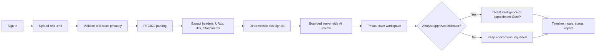

<div align="center">

# ◉ ORIGIN TRACKER

### **AI-powered email threat detection, geolocation, and forensic intelligence**

<p>
  <strong>SIH26106</strong> · Evidence-first SOC workbench · Real data only
</p>

<p>
  <a href="https://sih26106cybe-8m79cqnn.manus.space"><strong>Open the live workspace</strong></a>
  ·
  <a href="#quick-start">Run locally</a>
  ·
  <a href="#investigation-flow">Explore the workflow</a>
</p>

[](https://react.dev/)
[](https://www.typescriptlang.org/)
[](https://trpc.io/)
[](#responsible-analysis)
[](#current-boundaries)

> **What happened? What evidence supports it? What is still uncertain? What should the analyst do next?**

</div>

---

## Why Origin Tracker?

Security investigations often fail when evidence, interpretation, and external intelligence are mixed together. Origin Tracker keeps them separate. It gives an authorized analyst one private workspace to upload a real `.eml` file, inspect its structure, understand explainable risk signals, review a bounded AI interpretation, approve selected intelligence checks, and preserve the complete investigation timeline.

It is not a generic dashboard, chatbot, email sender, malware sandbox, or attribution engine. It is a **forensic decision-support system** that makes uncertainty visible instead of hiding it behind invented data.

<details>
<summary><strong>Click to see the platform promise</strong></summary>

<br />

| Promise | How the platform keeps it honest |
|---|---|
| **Evidence first** | Cases begin with uploaded or connected evidence rather than demo counters or fictional incidents. |
| **Explainable analysis** | Local findings include the signal, source location, severity, and reason. |
| **Bounded AI** | The model reviews authorized email evidence and returns validated structured output. |
| **Analyst approval** | External provider and geolocation checks require an explicit selection and approval. |
| **Privacy by default** | Cases, original emails, notes, reports, and provider results remain private to authorized users. |
| **Safe failure** | Missing indicators, invalid AI output, blocked IP ranges, and unavailable providers become visible safe states. |

</details>

## Investigation flow



<a id="investigation-flow"></a>

### The analyst journey

| Stage | What happens | Evidence preserved |
|---|---|---|
| **1. Sign in** | OAuth protects the workspace and scopes cases to the authorized user. | User identity and access boundary |
| **2. Submit evidence** | A real RFC822 `.eml` file is validated, privately stored, and hashed. | Original file metadata and SHA-256 identity |
| **3. Understand structure** | Trusted headers are separated from body content at the first blank-line boundary. | Sender, recipient, reply-to, return-path, received hops, auth results |
| **4. Score locally** | Explainable rules detect structural, URL, attachment, and authentication signals. | Rule IDs, severity, source location, explanations |
| **5. Review with AI** | A server-side model produces a bounded, evidence-linked interpretation. | Category, score, confidence, summary, model provenance |
| **6. Enrich selectively** | The analyst chooses an eligible indicator before a provider or map request. | Selected value, approval event, response, provider timestamp |
| **7. Close the loop** | Notes, status changes, similar-case signals, timelines, and reports complete the case. | Full investigation history and limitations |

## Capability map

<details open>
<summary><strong>Email forensics</strong></summary>

The first protected workflow supports `.eml` evidence. The parser extracts sender and recipient fields, trusted headers, SPF/DKIM/DMARC result text, received IPs, URLs, hostnames, attachment names, and structural findings when those values are present in the message.

> `.msg` is not labelled complete until a safe parser, isolation strategy, deployment dependency review, and tests exist.

</details>

<details open>
<summary><strong>Deterministic risk analysis</strong></summary>

Local analysis runs before AI or external enrichment. It can identify authentication failures, sender and reply-to mismatches, received-route anomalies, coercive language, suspicious URL forms, raw-IP links, unusual ports, risky attachment names, malformed headers, and ineligible IP ranges.

Every finding should remain understandable without an external provider or AI service.

</details>

<details open>
<summary><strong>Bounded AI review</strong></summary>

The AI reviewer receives only the authorized saved email evidence. It returns validated structured output such as a controlled threat category, risk score, confidence, plain-English explanation, observed social-engineering signals, and recommended analyst next steps.

The model does not browse links, execute attachments, validate DNS, claim exact attribution, or turn missing evidence into a fact. A truncated or invalid response preserves local analysis and exposes a protected retry path.

</details>

<details open>
<summary><strong>Analyst-approved intelligence</strong></summary>

The platform keeps external enrichment behind a shared server-side approval boundary:

| Path | Eligible input | Boundary |
|---|---|---|
| **AbuseIPDB** | One selected eligible public IP | No private, reserved, loopback, link-local, multicast, or documentation-only ranges |
| **VirusTotal** | One selected eligible public IP | The selected indicator is the intended provider input |
| **PhishTank** | One selected extracted URL | Bounded verified-online feed comparison with feed provenance |
| **Approximate GeoIP** | One approved eligible public IP | Location is approximate, not physical attribution |

</details>

## Architecture

```text
┌─────────────────────────────────────────────────────────────────────┐
│ Authenticated React + TypeScript investigation workspace            │
│ Dashboard · Cases · Evidence · Intelligence · Location · Reports    │
└───────────────────────────────┬─────────────────────────────────────┘
                                │ typed tRPC
┌───────────────────────────────▼─────────────────────────────────────┐
│ Express server                                                      │
│ OAuth · authorization · RFC822 parser · scoring · AI · provider gate │
└───────────────┬─────────────────┬─────────────────┬─────────────────┘
                │                 │                 │
        ┌───────▼───────┐ ┌──────▼──────┐ ┌────────▼─────────┐
        │ MySQL / TiDB  │ │ Private S3 │ │ Approved services │
        │ Drizzle ORM   │ │ evidence   │ │ AI · maps · intel │
        └───────────────┘ └─────────────┘ └──────────────────┘
```

| Layer | Technology | Responsibility |
|---|---|---|
| Client | React 19, TypeScript, Tailwind CSS, TanStack Query | Responsive analyst workspace and typed data access |
| API | Express, tRPC, Zod | Protected procedures, validation, authorization, and integrations |
| Database | MySQL/TiDB with Drizzle ORM | Users, cases, artifacts, indicators, events, notes, and enrichment metadata |
| Evidence storage | Private S3-compatible storage | Original `.eml` bytes and generated report files |
| Identity | Manus OAuth | Protected sessions and user-scoped case access |
| AI and maps | Server-side built-in services | Structured email review and saved approximate location visualization |

## Quick start

<a id="quick-start"></a>

The production workspace runs in a full-stack environment with OAuth, database, private storage, and server-side service configuration. A local installation needs equivalent environment values before protected workflows can operate.

```bash
git clone https://github.com/Vishalkumaran2007/SIgnalFurnace-1.0.git
cd SIgnalFurnace-1.0
pnpm install
pnpm dev
```

For the complete application source, use the active implementation repository:

```bash
git clone https://github.com/Vishalkumaran2007/SIH2K26.git
cd SIH2K26
pnpm install
pnpm dev
```

Useful development commands in the implementation repository:

```bash
pnpm test       # deterministic Vitest suite
pnpm check      # TypeScript validation
pnpm build      # production client and server build
pnpm db:push    # generate and apply schema migration in a configured environment
```

> Never commit `.env` files, OAuth secrets, database URLs, provider keys, uploaded email evidence, or private provider responses.

## Current boundaries

Origin Tracker reports capabilities based on working code and validated evidence, not on a checkbox alone.

| Available in the validated build | Deliberately bounded or still requiring additional evidence/work |
|---|---|
| Protected `.eml` ingestion and private evidence storage | `.msg` parsing |
| RFC822 structure extraction and SHA-256 evidence identity | Live DNS/domain reputation validation |
| Deterministic local signals | Malware execution or sandbox analysis |
| Bounded server-side AI review with retry handling | Exact attacker attribution or threat-actor certainty |
| Analyst-approved AbuseIPDB and VirusTotal paths | High-risk alert path requires an authorized qualifying email |
| PhishTank verified-online feed comparison | Real public-IP/map happy path requires an authorized routable indicator |
| Private case timeline, notes, status, CSV, and PDF reports | Synthetic or decorative graph/map/heatmap data |
| Documentation-only IP blocking | Any provider call without explicit analyst approval |

## Responsible analysis

> **Real data only.** The project must never seed fake cases, fake alerts, fake locations, fake provider responses, fake users, fake reviews, or fictional statistics.

All uploaded email, URLs, attachments, web pages, and provider responses are treated as untrusted data. Instructions contained inside evidence are not application instructions. API keys and session secrets stay server-side. AI output is an interpretation of available evidence, not proof. Provider and geolocation results are shown with their source, time, confidence, and limitations.

The shared indicator gate rejects private, loopback, link-local, multicast, reserved, and RFC 5737 documentation ranges before an external lookup. This means test addresses can remain useful forensic evidence without accidentally being sent to a live provider or map service.

## Visual identity

Origin Tracker is built around the journey of a cyber investigation:

```text
Source  →  Detection  →  Investigation  →  Intelligence
  ◉          ◌              ◎                  ✦
```

The authenticated workspace uses a Material You-inspired system with paired light and dark themes, readable evidence panels, clear hierarchy, responsive stacking, and restrained motion. The logo concept combines a source pin, radar sweep, connected intelligence nodes, and an AI core rather than relying on generic shields or locks.

## Repository map

| Path | Purpose |
|---|---|
| `client/` | React workspace, pages, components, styles, maps, and exports |
| `server/` | tRPC procedures, parsing, persistence, authorization, AI, and integrations |
| `drizzle/` | SQL schema and migrations |
| `functional_mvp_validation.md` | Evidence-based validation record |
| `integration_sources.md` | Provider references and implementation notes |
| `todo.md` | Transparent implementation and validation tracker |
| `SIH26106_improved_master_prompt.md` | Implementation blueprint and acceptance direction |

## Team

**Vishalkumaran V** — engineering, AI, software, and electronics contributor.

- Portfolio: [vishalkumaran2007.github.io/Portfolio](https://vishalkumaran2007.github.io/Portfolio/)
- Implementation repository: [Vishalkumaran2007/SIH2K26](https://github.com/Vishalkumaran2007/SIH2K26)
- Fresh documentation repository: [Vishalkumaran2007/SIgnalFurnace-1.0](https://github.com/Vishalkumaran2007/SIgnalFurnace-1.0)

## References

[1]: https://docs.abuseipdb.com/#introduction "AbuseIPDB API documentation"
[2]: https://docs.virustotal.com/reference/ip-info "VirusTotal IP object API documentation"
[3]: https://www.phishtank.net/developer_info.php "PhishTank developer information"
[4]: https://ipwhois.io/documentation "IPWHOIS API documentation"
[5]: https://www.rfc-editor.org/rfc/rfc5737 "RFC 5737 documentation address ranges"

Provider and protocol behavior should be checked against the official references before changing integrations or rate-limit handling. [1] [2] [3] [4] [5]

---

<div align="center">

**Built for evidence-led email investigations, not synthetic threat claims.**

</div>
